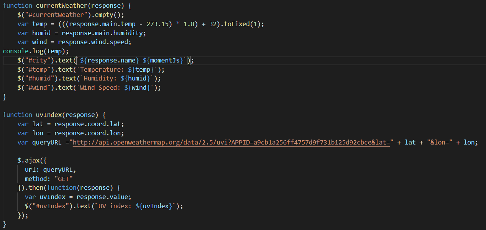

# Weather App
A weather app where the user can search for any city and see current weather, plus a 5 day forecast. Saves data to local storage to recall cities searched. Utilizes javascript/jquery techniques and the bootstrap grid to make responsive at different viewports (640px, 768px, 980px).

## Screen Grab (768px)

## Built With

* [HTML](https://developer.mozilla.org/en-US/docs/Web/HTML)
* [CSS](https://developer.mozilla.org/en-US/docs/Web/CSS)
* [Bootstrap](https://getbootstrap.com)
* [JavaScript](https://javascript.com)
* [jQuery](https://jqueryapi.com)

An example of the code to pull JSON data for current weather conditions.

## Deployed Link

* [Github Repository Page](https://github.com/rev1311/weather-forecast)

## Authors

* **Michael Partin** 

- [Link to Portfolio Site](https://rev1311.github.io/responsive-portfolio/)
- [Link to Github](https://github.com/rev1311)
- [Link to LinkedIn](https://linkedin.com/in/michael-partin-49ba1081)

See also the list of [contributors](https://github.com/your/project/contributors) who participated in this project. HINT: Just me.

## Acknowledgments

* 

